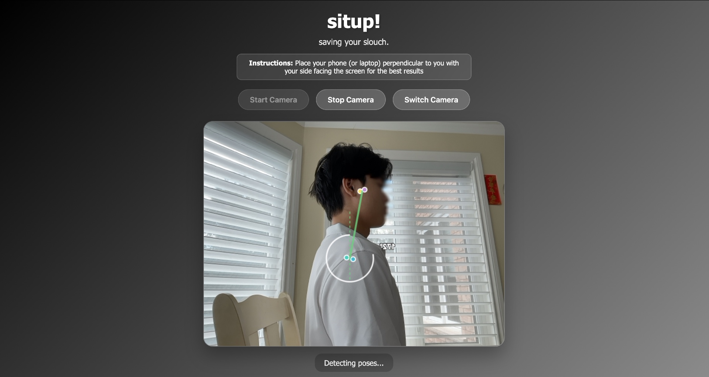
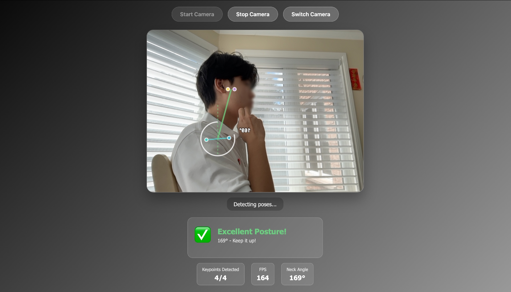
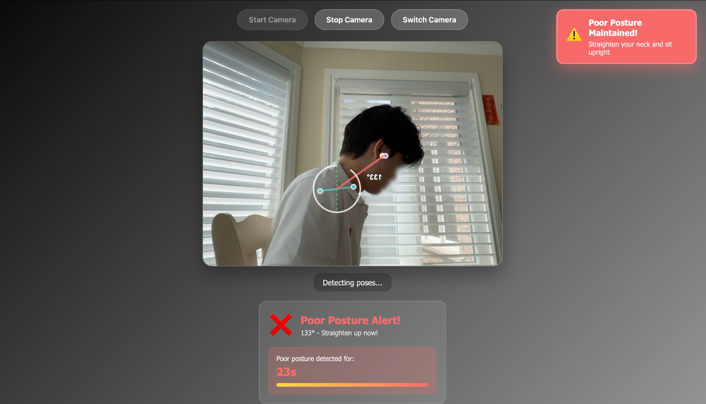

    

<h1 align="center">
    situp! - Live Posture Feedback
</h1>

   place your device to the side to begin tracking

   scroll down to get real-time stats as you work

   get warnings when poor posture persists

## Desc

Try it [HERE](https://evanzyang91.github.io/situp/) for free!

Made using Mediapipe pose detection API.
